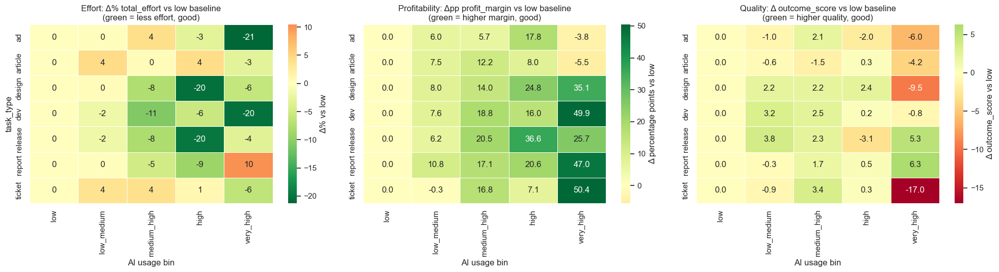
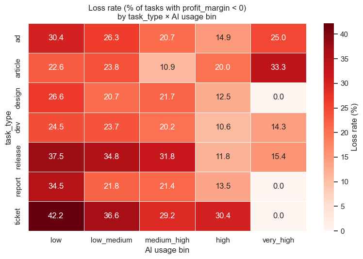
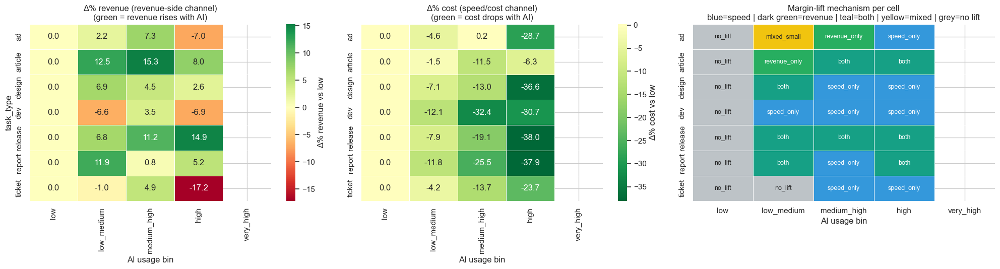
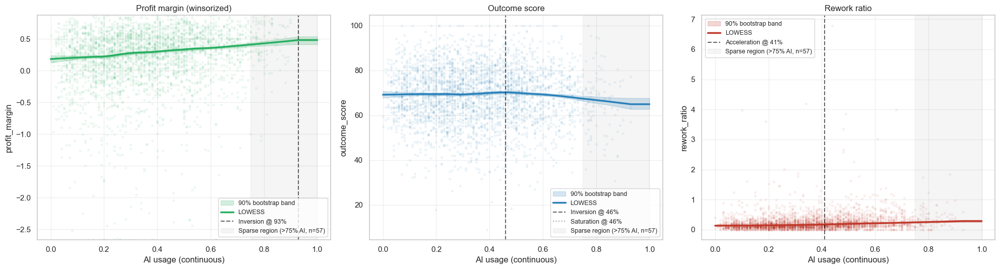
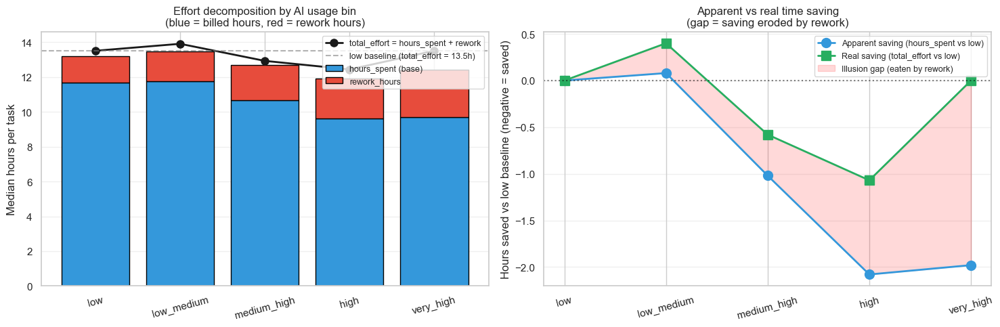
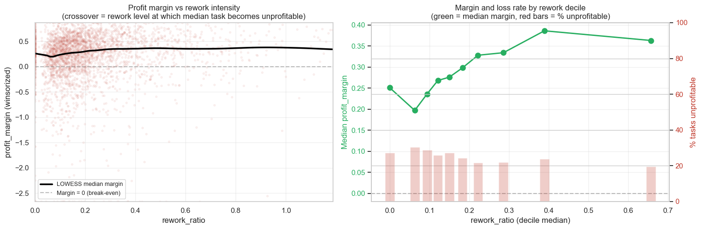
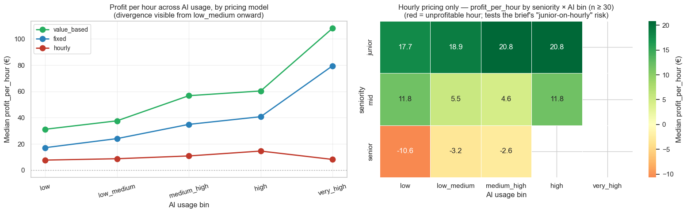
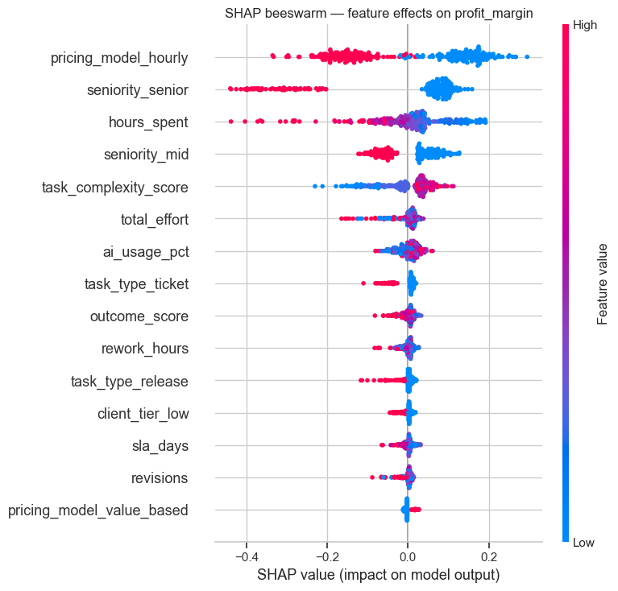
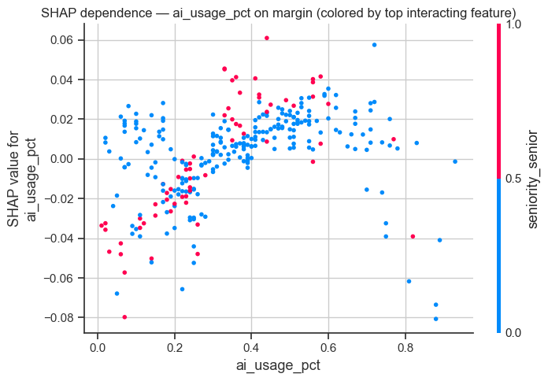
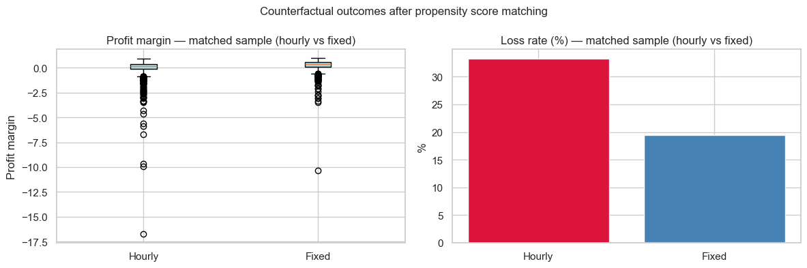

# AI Productivity: When AI Enters the Workflow

**Team Members:**  
Amanda Ambrosone
Giulio Presaghi
Beatrice Rossi

---

## Table of Contents

1. [Introduction](#1-introduction)
2. [Methods](#2-methods)
   2.1 [Environment](#21-environment)
   2.2 [Data Semantics](#22-dataset-semantics-a-foundational-investigation)
   2.3 [Data Cleaning](#23-data-cleaning)
   2.4 [Feature Engineering](#24-feature-engineering)
   2.5 [Analysis](#25-analysis)
   2.6 [Modeling](#26-modeling)
3. [Experimental Design](#3-experimental-design)
4. [Results](#4-results)
5. [Conslusions](#5-conclusions)
6. [AI Usage Disclaimer](#6-ai-usage-disclaimer)


## 1. Introduction
 
This project investigates how AI usage affects the operational margins of Alkemy, a digital agency. 
The dataset provided by Alkemy contains 3,248 tasks and 34 variables covering the full task lifecycle — inputs (briefing quality, complexity), process (hours spent, AI usage percentage), output (quality score, rework) and economic value (revenue, cost, profit). The operation spans four teams (Content, Design, Media, SEO), seven task types (ad, article, design, dev, release, report, ticket), three seniority levels, and three pricing models (hourly 48%, fixed 38%, value_based 14%).
 
The project addresses four main analytical questions and three advanced ones:
 
**Main questions:**
1. Where is value created? — In which task-type and AI-usage segments does AI simultaneously reduce effort, improve margin, and preserve quality?
2. Where are losses incurred? — Where do rework, quality erosion, and margin losses concentrate?
3. Is AI driving quality or just speed? — What economic mechanism underlies the observed margin lift?
4. When does AI become negative? — At what AI usage level do quality and rework turn against the operation?
**Advanced questions:**
1. Is the speed gain real, or an accounting illusion? — Does `hours_spent` tell the true story, or does rework absorb the apparent saving?
2. When does rework actually destroy margin? — Is there a rework intensity threshold beyond which profitability collapses?
3. When does the hourly pricing model become unsustainable? — How does the structural mismatch between AI efficiency gains and hourly billing evolve as AI adoption grows?

---

## 2. Methods

The project follows a five-stage pipeline. We start with a preliminary EDA on the raw data to understand its structure, identify anomalies, and settle foundational questions about variable semantics before touching anything. We then clean each variable individually, documenting every decision with an explicit justification. Once the data is clean, we engineer the features needed to answer the research questions — profitability ratios, effort metrics, AI usage bins. We then run the analysis across seven questions, moving from value creation to loss localization to threshold detection. Finally, we validate and quantify the exploratory findings through statistical and machine learning models: OLS with an interaction term, a Random Forest with SHAP, and Propensity Score Matching. Each stage informs the next: cleaning decisions depend on what the EDA revealed, feature definitions depend on what the analysis requires, and the modeling targets are defined by the thresholds and mechanisms the analysis identified.

### 2.1 Environment

The project was implemented in Python 3. Key libraries include:

- `pandas`, `numpy` — data manipulation
- `matplotlib`, `seaborn` — visualization
- `scikit-learn` — modeling and evaluation
- `scipy` — statistical testing 

To recreate the environment:

```bash (windows)
py -m venv name-of-environment
```

Or using a unix system:

```bash (unix)
python3 -m venv name-of-environment
```
Activating the Environment:

```bash (windows)
env\Scripts\activate
```

```bash (unix)
source venv/bin/activate
```

Installing Dependencies:

```bash (windows)
pip install -r requirements.txt
```

```bash (unix)
pip3 install -r requirements.txt
```
 
### 2.2 Dataset semantics: a foundational investigation
 
Before any cleaning or modeling, we conducted a formal investigation into the semantics of three pairs of variables whose interpretation was not self-evident. Getting this wrong would have invalidated the entire downstream strategy.
 
**Hours variables: task-level or per-phase?**

We verified that `hours_spent`, `billable_hours`, and `rework_hours` record effort for the entire task, not just the phase visible at export. Three tests confirmed this. First, among the 48 duplicate `task_id` records — the same task captured twice with different `workflow_stage` labels — 34/36 pairs with a stage change showed perfectly identical `hours_spent` and 36/36 identical `billable_hours`. Second, η² analysis showed that `task_type` explains 16.5% of variance in `hours_spent` and `task_complexity_score` another 9.3%, while `workflow_stage` (0.18%) and `task_status` (0.05%) sit at noise level. Third, the task-type effort ranking — ticket (7.7h) < ad (8.7h) < article (10.5h) < design (11.5h) < report (12.2h) < dev (13.8h) < release (15.0h) — is statistically significant (Kruskal-Wallis p ≈ 10⁻¹⁴³) and operationally coherent.

The conclusion is that the three hour variables are **independent compartments**, not nested subsets. The correct total effort measure is `total_effort = hours_spent + rework_hours`. `workflow_stage` and `task_status` carry no effort signal.

A first hint of the AI paradox also emerged here: short tasks (ticket, ad) carry proportionally higher rework ratios (20–23%) than long tasks (dev, release: 12–13%), suggesting that the task types with the largest apparent AI speed gain also bear the most rework overhead relative to their size.

**`ai_assisted` and the 20% system boundary**

By cross-referencing `ai_assisted` (boolean) with `ai_usage_pct` (continuous), we identified a system-level rule embedded in the data: `ai_assisted` is always `False` when `ai_usage_pct` is below 20%, and `True` above it. This is not a business judgment — it is a hard threshold baked into the logging system. Records violating this rule in either direction were corrected, making `ai_assisted` a deterministic projection of `ai_usage_pct` at the 20% boundary. This finding directly informed the feature engineering: the lower bound of the `ai_usage_bin` categories is fixed at 20% rather than data-driven, because it carries a precise operational meaning. Using a sample-driven cut would have obscured exactly the threshold dynamic the research questions target.

---

### 2.3 Data Cleaning
 
All 34 columns were inspected individually. Key decisions:
 
**Duplicates:** 48 `task_id` pairs (96 rows) showed identical business data but diverging metadata. The most recent `updated_at` row was kept per pair, dropping 48 rows.
 
**Categorical normalization:** `team` had 15 variants (case errors, typos, subcategories) mapped to 4 canonical teams; `task_type` had 29 variants mapped to 7 canonical types. The result is a perfectly balanced team distribution (~25% each) and a well-balanced task type distribution (~443-478 per category).
 
**`hours_spent` anomalies:** we replaced a naive fixed-threshold approach with a diagnostic-based criterion. A record is flagged as corrupted if its `billable_ratio = billable_hours / hours_spent` falls below 0.15 or above 5 — thresholds corresponding to roughly 4.6× and 7× the population median respectively. This identified ~39 records with internally inconsistent hour accounting, cross-validated by a second independent diagnostic (`cost_per_hour < 15 €/h` vs. population median ~58 €/h). Corrupted values were imputed using `hours_spent = billable_hours / recovery_rate(pricing_model)`, where recovery rates are pricing-model-specific medians computed on clean records. Records with both fields corrupted simultaneously (irrecoverable) were dropped.
 
**`billable_hours` anomalies:** 82 missing values and 17 negative values (small write-offs at task closure, −1.90 to −0.28h) were imputed symmetrically using `billable_hours = hours_spent × recovery_rate(pricing_model)`. The same `efficiency_ratio` anchors imputation in both directions depending on which field is corrupted.
 
**`ai_usage_pct`:** 142 missing values imputed using a hierarchical group-based median strategy. A bivariate η² comparison across all candidate predictors identified `seniority × task_complexity_score × team × deadline_pressure` as the combination explaining the most variance (21.8%). To avoid degenerate medians from sparse cells, a three-level hierarchy was applied: L1 (4 variables, N ≥ 5) → L2 (3 variables, drop `team`) → L3 (2 variables). Approximately 95% of NaN records were imputed at L1; none required the L3 fallback.
 
**`rework_hours`:** 71 missing values imputed with a single-level group median on `scope_change_flag × task_complexity_score × deadline_pressure` (η² = 8.4%, the highest among tested combinations). Process-context variables — scope changes, complexity, deadline pressure — proved far more predictive of rework than team or seniority, consistent with rework being driven by task-specific events rather than worker characteristics. All 30 resulting groups had N ≥ 8, so no fallback was needed.
 
**`outcome_score`:** 132 missing values imputed using a linear regression model (5-fold CV R² ≈ 0.35) rather than group-based median, because strong continuous predictors were available (`errors` r = −0.48, `brief_quality_score` r = +0.35) and group-median imputation would have thrown away the slopes of these relationships.
 
**Date anomalies:** 14 records with `delivered_at < created_at` were resolved using a swap test. If swapping the two dates produces an `actual_days` consistent with the recorded `sla_breach`, the dates are swapped; otherwise the record is irrecoverable. 8 records were recovered by swap, 6 dropped.
 
**`ai_assisted` consistency:** a system-level rule was identified: `ai_assisted = False` when `ai_usage_pct < 0.20`. Records violating this rule in both directions were corrected, making `ai_assisted` a clean deterministic projection of `ai_usage_pct` above the 0.20 threshold.

### 2.4 Feature Engineering
 
Nine features were derived from the clean dataset:
 
- `profit_margin = profit / revenue` — core profitability KPI; the primary target for threshold analysis
- `efficiency_ratio = billable_hours / hours_spent` — billing efficiency; share of work hours actually billed
- `rework_ratio = rework_hours / hours_spent` — quality cost; share of time spent on corrections
- `cost_per_hour = cost / hours_spent` — operational cost per hour worked
- `revenue_per_hour = revenue / hours_spent` — revenue generated per hour worked
- `total_effort = hours_spent + rework_hours` — true effort accounting for rework as an additive compartment
- `profit_per_hour = profit / total_effort` — true profitability per unit of effort actually invested; computed on `total_effort` rather than `hours_spent` to capture the rework cost that hourly metrics hide
- `delivery_speed = delivery_days_actual / sla_days` — SLA performance ratio; < 1 means on time
- `ai_usage_bin` — five business-driven bands aligned with Alkemy's operational categorization: low [0, 20%), low_medium [20, 40%), medium_high [40, 60%), high [60, 80%), very_high [80, 100]
The 20% boundary is fixed rather than sample-driven because it has a hard system-level meaning (`ai_assisted` threshold). Sample-driven binning would obscure exactly the threshold dynamic the research question targets.


### 2.5 Analysis

The analysis is structured around seven questions — four main and three advanced — all answered on the cleaned, feature-engineered dataset. The core method is segmentation: rather than looking at AI usage in aggregate, we break the data into task_type × ai_usage_bin cells and compare each cell against its own low-AI baseline. This controls for the fact that different task types have structurally different effort and margin profiles.

For value creation (Q1), we apply a joint three-axis test: a cell qualifies only if effort, margin, and quality all move in the favorable direction simultaneously, with at least 30 observations. For loss localization (Q2), we map loss rate, rework ratio, and outcome score across the full grid and use a chi-square test to determine whether losses are driven by AI usage or task type. For the margin decomposition (Q3), we classify each cell into operational regimes (quality-only, speed-only, joint, flat) and then decompose the P&L delta into cost and revenue components. For threshold detection (Q4), we fit LOWESS curves of outcome score, rework ratio, and profit margin against ai_usage_pct as a continuous variable, with bootstrap confidence bands, separately for each task type.

The three advanced analyses extend the main findings: A1 compares hours_spent and total_effort trends across bins to test whether the apparent time saving survives when rework is added back; A2 looks at rework_ratio quantile bins against profit_margin to test for a margin-collapse threshold; A3 tracks profit_per_hour by pricing_model × ai_usage_bin and breaks it down by seniority.


### 2.6 Modeling

The modeling section validates and quantifies the exploratory findings through three complementary approaches. An OLS regression predicts `profit_margin` and includes a custom interaction term `ai_usage_pct × pricing_model_hourly` to formally test whether AI affects margin differently under hourly billing. A Random Forest (300 trees, max_depth=10, min_samples_leaf=10) captures non-linear and interaction effects; SHAP values are computed on a 300-task test subsample to show direction, magnitude, and the shape of the AI usage–margin relationship across the continuum. Propensity Score Matching (PSM) estimates the causal effect of hourly vs. fixed pricing by matching each hourly task to the most similar fixed-price task on ten observable covariates, with a caliper of 0.05, and computing the ATT on profit_margin and loss rate.
---
 
## 3. Experimental Design
 
All analytical experiments are conducted in Section 6 of the notebook. Each experiment targets one of the project's seven research questions using the cleaned and feature-engineered dataset.
 
### Q1 — Where is value created? (Section 6.1)
 
**Purpose:** Identify which combinations of task type and AI usage level generate a genuine, simultaneous improvement across all three value dimensions: less effort, higher profit margin, and stable or improved quality.
 
**Baseline:** A binary comparison between low-AI tasks (ai_usage_pct < 20%) and all other tasks. This aggregate view showed a +50% median margin lift for AI-assisted tasks but no reduction in effort and no improvement in quality — a misleading result that motivates the finer-grained segmentation.
 
**Evaluation metrics:** Δ% `total_effort`, Δpp `profit_margin`, and Δ `outcome_score` computed per task_type × ai_usage_bin cell, each relative to the same task type's own low-AI baseline. A cell qualifies as value-creating only if all three metrics move simultaneously in the favorable direction and the cell contains at least 30 observations. Statistical significance on the three axes is tested with Mann-Whitney U (two-sided).


 
### Q2 — Where are losses incurred? (Section 6.2)
 
**Purpose:** Locate where rework costs, quality erosion, and margin losses concentrate across the task_type × ai_usage_bin grid, and determine whether these losses are driven by AI usage or by task type.
 
**Baseline:** Overall dataset loss rate (share of tasks with profit_margin < 0) and overall rework_ratio median, used as reference for each bin and task type.
 
**Evaluation metrics:** Loss rate (% of tasks with negative profit_margin), median `rework_ratio`, `outcome_score` trend, and `errors` count across cells. Chi-square test for independence between ai_usage_bin and loss rate.


 
### Q3 — Quality or just speed? (Section 6.3)
 
**Purpose:** Decompose the source of the observed margin lift — determining how much comes from cost reduction (fewer or cheaper hours) versus revenue increase (higher quality output attracting better billing).
 
**Baseline:** Naive assumption that margin improvement reflects genuine productivity gains.
 
**Evaluation metrics:** Δ`cost`, Δ`revenue`, and Δ`total_effort` across ai_usage_bin, with the relative magnitude of cost and revenue contributions to the total margin lift quantified in percentage terms.



### Q4 — When does AI become negative? (Section 6.4)
 
**Purpose:** Identify the AI usage threshold beyond which quality degrades and rework accelerates, both in aggregate and separately for each of the four value-creating task types.
 
**Baseline:** Aggregate curves across the full dataset; per-task-type curves used as refinement to detect type-specific ceilings.
 
**Evaluation metrics:** Trend direction of `outcome_score`, `rework_ratio`, and `profit_margin` as continuous functions of `ai_usage_pct`. The threshold is defined as the first AI level at which quality or rework begins to move adversely with non-trivial magnitude.
 


### Advanced 1 — Is the speed gain real? (Section 6.7)
 
**Purpose:** Test whether the reduction in `hours_spent` at higher AI usage reflects a genuine time saving or whether the saved hours return as rework, leaving `total_effort` unchanged.
 
**Baseline:** `hours_spent` alone as the productivity metric, which is what headline delivery metrics typically report.
 
**Evaluation metrics:** Comparison of `hours_spent` and `total_effort` trends across ai_usage_bin. The gap between the two curves — expressed as absolute hours and as a share of the apparent saving — measures the illusion component.


 
### Advanced 2 — When does rework destroy margin? (Section 6.8)
 
**Purpose:** Determine whether there is a rework intensity level (rework_ratio) at which profit_margin systematically turns negative, i.e., a rework-driven margin collapse threshold.
 
**Baseline:** Assumption that higher rework erodes margin monotonically, as the project brief implies.
 
**Evaluation metrics:** Median `profit_margin` and loss rate (% profit_margin < 0) across `rework_ratio` quantile bins. A threshold would be visible as a discrete drop in median margin or a sharp increase in loss rate.


 
### Advanced 3 — When does the hourly model become unsustainable? (Section 6.9)
 
**Purpose:** Quantify how the profit disadvantage of hourly pricing evolves as AI adoption increases, and whether the disadvantage is modulated by seniority.
 
**Baseline:** Aggregate pricing-model comparison at the overall dataset level (profit_per_hour by pricing_model).
 
**Evaluation metrics:** Median `profit_per_hour` by `pricing_model × ai_usage_bin`; gap in €/hour between hourly and alternative pricing models at each AI bin; within-hourly breakdown by seniority to test whether specific seniority-pricing combinations become structurally unprofitable.


 
### Modeling 1 — Profitability drivers under controls (Section 7.2)
 
**Purpose:** Test whether the negative relationship between excessive AI usage and profitability persists after controlling for task type, complexity, seniority, and other operational variables. Formally test whether the AI effect on margin differs under hourly vs. non-hourly pricing.
 
**Baseline:** The raw EDA association between AI usage and profit_margin, without multivariate controls.
 
**Evaluation metrics:** OLS: 5-fold CV R², coefficient magnitude and sign for `ai_usage_pct`, `ai_x_hourly` interaction term, `seniority_senior`, and `pricing_model` dummies. Random Forest: test R², RMSE, MDI feature importance, SHAP mean |value| ranking, SHAP beeswarm direction plot, SHAP dependence plot for `ai_usage_pct`.

 
 
### Modeling 2 — Pricing policy counterfactual (Section 7.3)
 
**Purpose:** Estimate the causal effect of hourly vs. fixed pricing on profit_margin and loss rate, controlling for the fact that hourly and fixed tasks are not identical in task characteristics.
 
**Baseline:** Naive comparison of hourly vs. fixed outcomes in the unmatched dataset, which confounds pricing structure with task-level differences.
 
**Evaluation metrics:** ATT (Average Treatment Effect on the Treated) on `profit_margin`, expressed in percentage points; loss rate difference between matched hourly and fixed tasks; paired t-test p-value; propensity score overlap plots before and after matching as balance check.


 
---

## 4. Results

Looking at AI usage as a single number is misleading. AI-assisted tasks show a median profit margin about 50% higher than non-AI tasks, but effort and quality are flat. That aggregate hides very different outcomes depending on task type and AI intensity.

When we segment by task type and AI usage level, the picture becomes clear. AI genuinely creates value — effort down, margin up, quality stable — only in four task types: design, dev, release, and report, at moderate AI usage (25–75%). These represent about 30% of the dataset. In the best cases, effort drops by 8–20% and profit margin improves by 8–25 percentage points, with quality holding or improving slightly. Creative tasks (ad, article) never meet all three conditions at any AI level. Ticket work gains margin but saves no effort. Above 80% AI usage, quality drops sharply — up to 17 outcome points below the low-AI baseline — in every task type with enough observations.

On losses, the result is counterintuitive. The share of unprofitable tasks falls as AI usage rises, from 31.5% at low AI down to 14.0% at very high AI. Losses are driven by task type, not AI: ticket tasks are unprofitable in 30–42% of cases regardless of AI level. Rework grows with AI, but does not directly cause margin losses — both rework and margin rise together because both are driven by AI adoption, which also compresses costs.

Q3 has two parts. On the work side, AI is primarily a quality tool: the most common outcome is quality improvement without time savings (28% of tasks), while pure speed gains are rare — just 3.1% of tasks. On the financial side, the margin gains come mostly from cost reduction, not revenue growth. Cost falls by roughly €211 per task from low to high AI, while revenue rises only ~€47. This happens because AI allows junior staff to take on work that would otherwise require senior staff, which lowers the cost per task. So quality goes up and cost goes down at the same time — these two findings together explain where the margin lift comes from.

Q4 identifies where AI starts to hurt. The safe ceiling is around 40% AI for dev, 38–45% for design and release, and 60–65% for report — the only task type with room to push further. Beyond these points, quality scores decline and rework accelerates. The problem is that profit margin keeps rising past these ceilings, because cost compression continues. This makes margin a lagging indicator: it looks fine while quality and rework are already moving in the wrong direction.

The three advanced analyses add three specific findings. Roughly half the apparent time saving from AI disappears when rework is included; at very high AI usage the saving is fully absorbed — billed hours are ~2 hours below baseline but rework adds those same 2 hours back, leaving total effort unchanged. A rework-driven margin collapse never appears in the data — rework and margin both rise together, so the binding limit is quality, not rework volume. Under hourly billing, profit per hour stays flat at €8–15 regardless of AI usage, while under fixed it rises from €17 to €40 and under value_based from €31 to over €100. When AI saves time on an hourly contract, those saved hours cannot be billed — the gain goes to the client. Within hourly pricing, senior tasks lose money per hour at every AI level (−2 to −11 €/h); juniors are the only group that stays profitable.

The modeling results confirm and sharpen these findings. The OLS interaction term `ai_usage_pct × pricing_model_hourly` (coefficient −0.27) formally confirms that AI reduces margin on hourly projects: the baseline AI coefficient is +0.14, so the net effect under hourly pricing is −0.13. `seniority_senior` is the largest single negative driver (−0.44), consistent with senior costs eroding margins when AI could enable juniors to do the same work. `pricing_model_value_based` is the strongest positive driver (+0.15), implying a theoretical margin swing of +0.30 moving from hourly to value_based. The Random Forest (test R² = 0.38) confirms the non-linearity: SHAP values show that moderate AI adoption (35–60%) contributes positively to predicted margin, while above 70% the contributions become increasingly negative and dispersed. Seniors leverage AI better than juniors at moderate levels, but the advantage collapses above 80% usage. The PSM analysis provides the clearest causal evidence on pricing: after matching hourly and fixed tasks on ten observable covariates, switching from hourly to fixed pricing is associated with a 14 percentage point reduction in loss rate (hourly: ~33%, fixed: ~19%), confirmed by a paired t-test. Hourly tasks also show much deeper margin outliers (below −15.0) than matched fixed tasks, meaning hourly pricing introduces structural downside risk that persists even when task complexity is held constant.

| Key metric | Value |
|---|---|
| Share of tasks where AI creates joint-axis value | ~30% |
| Optimal AI range for technical task types | 25–75% |
| Safe ceiling for dev / design / release | ~38–45% |
| Safe ceiling for report | ~60–65% |
| Best margin lift (design × high AI) | +24.8 pp |
| Speed saving absorbed by rework at high AI | ~49% |
| Speed saving absorbed by rework at very_high AI | ~100% |
| profit_per_hour gap: value_based vs. hourly at medium_high AI | +€45.9/h |
| Loss rate for ticket tasks across all AI levels | 30–42% |
| OLS interaction coefficient (ai × hourly) | −0.27 |
| RF SHAP positive AI contribution range | 35–60% |
| PSM loss rate reduction (hourly → fixed) | −14 pp |


----

## 5. Conclusions
 
### Summary

AI is not a uniformly value-creating technology at Alkemy. The exploratory analysis — internally consistent across seven independent analytical angles — and the modeling results converge on the same picture. AI creates real, measurable value in roughly 30% of the operational mix: technical task types (dev, design, release, report) at moderate AI usage (25–75%), under non-hourly pricing. In the remaining 70% it generates no net benefit or causes active harm. The economic mechanism is cost-arbitrage: AI reduces the cost of production by enabling juniors to handle work previously done by seniors, compressing internal cost per hour. This is confirmed both by the OLS decomposition and by SHAP values, which rank `seniority_senior` as the second-largest negative driver of profit margin after pricing model. The safe operational ceiling is approximately 40–50% AI usage for most technical tasks — consistent across the LOWESS curves in the EDA and the SHAP dependence plot in the RF model. Beyond this point, quality erodes while the P&L continues to look fine, because cost compression masks the degradation. The hourly pricing model is the structural bottleneck: the OLS interaction term (−0.27) confirms that AI makes hourly projects less profitable, not more, and PSM quantifies the cost at roughly 14 percentage points of additional loss rate compared to equivalent fixed-price tasks. The strategic implication is not "deploy more AI" but "fix the pricing structure first, then scale AI selectively" — cap usage at measured thresholds per task type, push harder only on report, disengage on creative and support work, and migrate hourly contracts toward fixed or value_based pricing before any further AI rollout.
 

### Open questions and future work
 
Several important questions remain unanswered. First, the PSM analysis controls for observable confounders but cannot rule out unobserved ones — a randomized pricing experiment or a natural experiment would be needed to fully establish causality. Second, quality erosion above the AI threshold is measured by `outcome_score` at delivery; the downstream effects on client retention and repeat revenue are not in the data, so the full economic cost of pushing AI too far may be substantially larger than what the current margin analysis captures. Third, the dataset lacks variables that would sharpen both the EDA and the models: the specific AI tool used per task (different tools likely have very different quality profiles), client satisfaction measured post-delivery, the split between internal vs. client-facing revision cycles, and the marginal cost per AI usage unit. Fourth, the current models explain roughly 31–38% of profit_margin variance. The remaining variance likely reflects client-level or project-level effects not captured in the task-level features — a multilevel model with random effects for client or project_id would be a natural next step and could surface whether the AI paradox is uniform across clients or concentrated in specific accounts.

## 6. AI Usage Disclaimer
 
We used Claude (Anthropic) as our primary AI assistant throughout the project. In line with Alkemy's tracking requirements, this section documents how and why we used it.
 
**What we did ourselves.** The analytical roadmap was defined entirely by the team: which questions to ask, which variables to investigate, which methodological choices to justify, and how to interpret results. All key decisions — the diagnostic-based criterion for `hours_spent` anomalies, the swap test for date inconsistencies, the hierarchical imputation strategy, the joint three-axis definition of AI value creation, and the interpretation of every finding — were reasoned through by the team before being implemented.
 
**What we used AI for.** We used Claude primarily for two things: suggesting clean, well-structured Python code only for complex visualizations and some useful statistical functions; and formatting outputs in Markdown. In both cases, we provided the logic, the variables, and the expected output; the AI translated that into working code or structured prose.
 
**How we prompted.** Our prompts were always problem-specific and grounded in prior results. We described the analytical goal, specified which variables and transformations to use, and asked for code or text that implemented a decision we had already made. When AI output was incorrect or inconsistent with the data, we identified the error and asked for a correction with an explicit explanation of what was wrong. We never used AI to generate analytical decisions or interpret results on our behalf.
 
**What this means for reproducibility.** Every piece of code in the notebook reflects a design choice made by the team. The AI was a tool for implementation, not a substitute for reasoning.